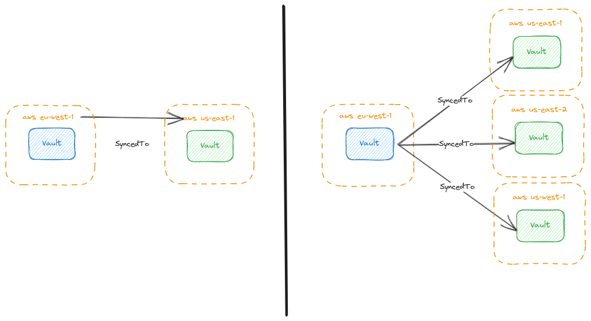

# Vault Cluster Replication (vault-cluster-replication)

<p align="center">
  <a href='http://makeapullrequest.com'>
    
  </a>
</p>

- [Vault Cluster Replication (vault-cluster-replication)](#vault-cluster-replication-vault-cluster-replication)
  - [Introduction](#introduction)
  - [Schema](#schema)
  - [Vault Configuration](#vault-configuration)
  - [Configuration](#configuration)
    - [Environment Variables](#environment-variables)
    - [Replication Configuration](#replication-configuration)
    - [Credentials Configuration](#credentials-configuration)
  - [Deploy to Kubernetes](#deploy-to-kubernetes)
    - [Deployment command](#deployment-command)
  - [Run vault-cluster-replication locally](#run-vault-cluster-replication-locally)
    - [Prerequisites](#prerequisites)
    - [Setup](#setup)
      - [Create a KinD cluster](#create-a-kind-cluster)
      - [Run Tilt](#run-tilt)
      - [Access Vault UI](#access-vault-ui)

## Introduction

Vault Cluster Replication Application allows you to replicate data between Hashicorp Vault clusters, ensuring consistency and availability across multiple instances. This is particularly useful in scenarios where high availability and disaster recovery are essential.

Also in case of you want to have a replication between cloud providers or regions.

## Schema



## Vault Configuration

The application requires the following configuration to be set in Vault:

- (Mandatory) [Raft storage](https://www.vaultproject.io/docs/configuration/storage/raft)
- (Recommended) [Auto-unseal](https://www.vaultproject.io/docs/concepts/seal#auto-unseal)
  - In case auto-unseal is not used, manual unsealing is required **only during the first synchronization**, as the unseal keys will be synced to secondary clusters. After that, synchronization will work automatically.

## Configuration

### Environment Variables

The application requires the following environment variables to be set:

- `CONFIG_FILE_PATH`: The path to the configuration file.
- `SCHEDULED_EXECUTION_INTERVAL`: The interval at which the synchronization process is executed. The default value
  is `5m`. Values must be `s` (seconds), `m` (minutes), `h` (hours)
  - Example: `10s` (10 seconds), `5m` (5 minutes), `1h30m` (1 hour and 30 minutes)

Below is an example `CONFIG_FILE_PATH` configuration:

```yaml
---
replication:
  - active: "http://vault-1-cluster:8200"
    sync_to:
      - "http://vault-2-cluster:8300"
  - active: "http://vault-3-cluster:8300"
    sync_to:
      - "http://vault-4-cluster:8200"
      - "http://vault-5-cluster:8200"
credentials:
  - name: "http://vault-1-cluster:8200"
    appRole: "vaultClusterReplication"
    secretID: "root"
  - name: "http://vault-2-cluster:8200"
    appRole: "vaultClusterReplication"
    secretID: "root"
  - name: "http://vault-3-cluster:8200"
    appRole: "vaultClusterReplication"
    secretID: "root"
  - name: "http://vault-4-cluster:8200"
    appRole: "vaultClusterReplication"
    secretID: "root"
  - name: "http://vault-5-cluster:8200"
    appRole: "vaultClusterReplication"
    secretID: "root"
```

### Replication Configuration

The replication configuration section allows you to specify the replication relationships between Vault clusters. Each entry consists of:

- **active**: The URL of the source Vault cluster.
- **sync_to**: A list of destination Vault clusters to which data will be replicated.

You can define multiple replication configurations to manage different replication scenarios.

### Credentials Configuration

In the credentials configuration section, you define the authentication credentials for each Vault cluster. Each set of credentials includes:

- **name**: The URL of the Vault cluster associated with these credentials.
- **appRole**: The AppRole used for authentication.
- **secretID**: The secret ID associated with the AppRole.

These credentials are used to authenticate and establish connections between clusters for data replication.

AppRole needs to have a policy that allows the following operations:

```hcl
path "sys/mounts" {
  capabilities = ["read", "list"]
}
path "sys/policies/acl/*" {
  capabilities = ["read"]
}
path "sys/storage/raft/snapshot*" {
  capabilities = ["create", "update", "read"]
}
path "sys/raft/snapshots/*/restore" {
  capabilities = ["update"]
}
```

For enhanced security, consider using Kubernetes Secrets to store the configuration and credentials for the Hashicorp Vault Cluster Replication Application. Kubernetes Secrets allow you to store sensitive information in a secure manner, separate from your application code.

## Deploy to Kubernetes

The application can be deployed to Kubernetes using the [Helm chart](./deployment/kubernetes/helm/).

The Helm chart requires the following configuration to be set:

- `configFile`: The path to the configuration file.
- `scheduledExecutionInterval`: The interval at which the synchronization process is executed. The default value is `5m`.
  Values must be `s` (seconds), `m` (minutes), `h` (hours)
  - Example: `10s` (10 seconds), `5m` (5 minutes), `1h30m` (1 hour and 30 minutes)
  - Default: `5m`
  - Required: `false`

### Deployment command

```bash
helm install vault-cluster-replication ./deployment/kubernetes/helm/ -f ./deployment/kubernetes/helm/values.yaml
```

## Run vault-cluster-replication locally

### Prerequisites

- [Tilt](https://tilt.dev/)
  - Tilt is a development tool that helps streamline the inner development loop.
- [Docker](https://www.docker.com/)
  - Docker is a containerization platform that allows you to package applications and their dependencies into lightweight containers
- [kind](https://kind.sigs.k8s.io/)
  - kind, short for "Kubernetes in Docker," is a tool for running local Kubernetes clusters using Docker containers as nodes
- [kubectl](https://kubernetes.io/docs/tasks/tools/install-kubectl/)
  - kubectl is the official command-line tool for interacting with Kubernetes clusters.
- [helm](https://helm.sh/docs/intro/install/)
  - Helm is a package manager for Kubernetes that simplifies the deployment and management of complex applications

### Setup

The test environment is based on Tilt.
The tilt fins can be found in the [tilt](./tilt) directory.

#### Create a KinD cluster

```bash
kind create cluster
```

#### Run Tilt

Run the following command in the terminal to start Tilt:

```bash
cd tilt/
./tilt up
```

Tilt will orchestrate the creation of two Vault clusters named `vault-1` and `vault-2` within a Kubernetes cluster (
using Kind).

Throughout the process, there are two specific manual actions that require your attention. These actions involve
unsealing the Vault clusters and creating an `appRole` for the application's interaction.

Here's a step-by-step breakdown of the process:

1. Tilt will initiate the deployment of the `vault-1` cluster. At this point, your manual intervention is needed. You
   should perform the following steps:
   - Execute the `vault-1-operator-init.sh` script via the Tilt UI to set everything in motion.
   - Unseal the `vault-1` cluster.
   - Create an `appRole` tailored for the application.

2. Following the successful deployment of `vault-1`, Tilt will proceed to set up the `vault-2` cluster. Similarly, this
   phase requires your input:
   - Initiate the `vault-2-operator-init.sh` script through the Tilt UI.
   - Unseal the `vault-2` cluster.
   - Establish the corresponding `appRole` configuration for the application.

By following these steps, you'll ensure the proper unsealing of both Vault clusters and the creation of
application-specific `appRole` configurations. Tilt streamlines the deployment process, while your manual involvement
guarantees the appropriate setup of each cluster and the seamless integration of the application.

#### Access Vault UI

Tilt will set up port forwarding for you, so you can access the Vault UI in your browser:

For vault-1, visit [http://localhost:8200](http://localhost:8200)
For vault-2, visit [http://localhost:8300](http://localhost:8300)

As a result of this setup, 2 new files will be created in the [tilt](./tilt) directory:

- `vault-1_unseal_keys.json`
- `vault-2_unseal_keys.json`

They will contain the unseal and root tokens for each Vault cluster. You can use these tokens to access the Vault UIs.
